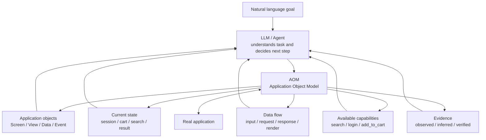
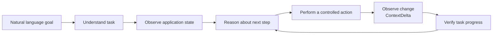
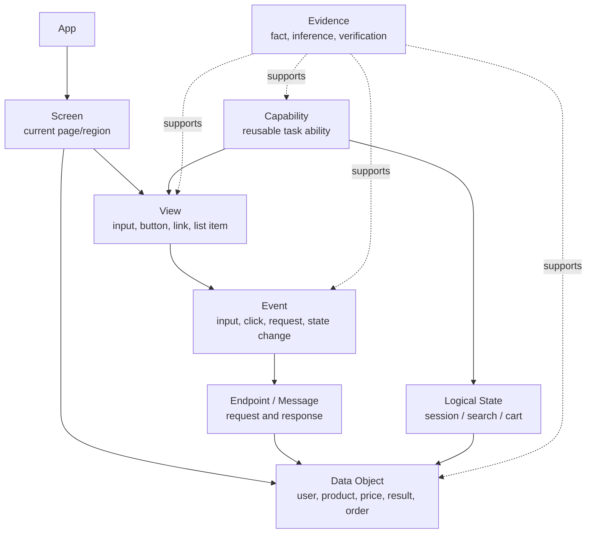
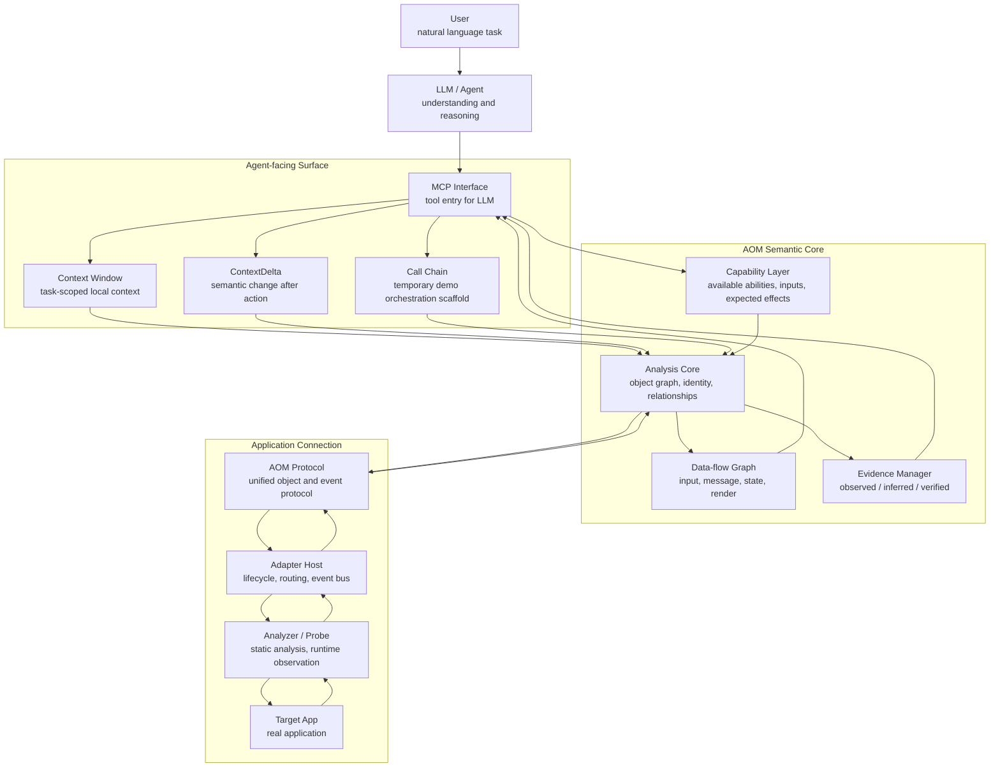
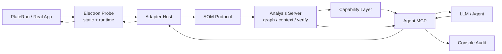

# AOM: Application Object Model

<p align="center">
  <a href="./README.md">中文</a> | English
</p>


> Note: I am not deeply familiar with mature Agent development systems. The ideas and designs in this project may still be rough, and some of them may be overturned by further practice. I also understand that one person's ability is limited, while the problem AOM tries to touch is large and long-term. This README should be read as a temporary record of thinking and a concept demo, not as a finished standard answer. Criticism, discussion, and correction are welcome.

AOM, short for Application Object Model, is a concept exploration project.

The effect it wants to explore is:

> A user describes a goal in natural language, and an LLM can understand the current application, understand the user's task, and reason about the next steps by itself during execution.

In other words, AOM does not begin with "how to automatically click a button." Its real concern is: when an LLM faces a real application, how does it know where it is, what it is seeing, what the user wants, what it should do next, and whether the previous step actually moved the task forward?

This project is still an early demo. It has many limitations: real-application coverage is limited, the Safety Gateway is not complete, data flow is still MVP-level, and system-level runtime/hook capabilities are still future work. The goal of this project is to propose the idea of AOM and implement a small but reality-oriented prototype.

## What AOM Tries to Solve

Natural language is straightforward for humans:

```text
Search for tech news and open a relevant result.
```

But for an LLM/Agent, this sentence implies a chain of understanding and decisions:

```text
What kind of application is this?
Which page or state is it currently in?
Where can I search?
Has the search already completed?
Which items are results?
Which result is relevant to the task?
Is the task done after opening it?
If nothing changed, should I retry, switch targets, or stop?
```

If an Agent only sees screenshots, OCR text, coordinates, DOM selectors, or a giant unstructured tool response, it can easily fall into two failure modes:

- it appears able to operate, but does not know why it is doing something;
- after taking a step, it does not know whether the task advanced, so it repeats searches, clicks again, or wanders through context.

The core idea of AOM is to give the LLM an application semantic layer, so it does not face chaotic interface signals directly, but instead reasons over an application object model.

## What Is an Application Object Model?

AOM can be understood as a world model of an application for LLMs.

It organizes the structure, state, events, data flow, and capabilities of a real application into objects and relationships that an LLM can reason about.



With this model, the LLM does not merely see "some text and buttons on the screen." It can ask:

```text
What is the current page?
Which stable objects are present?
How are these objects related to business state?
Which actions may advance the user's task?
What changed after the previous action?
Is that change supported by evidence?
```

This is the meaning of Object Model in AOM. It does not flatten the interface into pixels or text. It re-expresses the application as an object system that can be understood, queried, and verified.

## AOM Does Not Replace LLM Reasoning

AOM should not become a black-box executor.

It is closer to a structured perception and feedback layer for the LLM:

```text
The LLM understands the goal, weighs choices, and decides the next step.
AOM describes the application, exposes capabilities, performs controlled actions, and reports evidence-backed changes.
```

Ideally, the LLM and AOM form a loop:



The key point is not "automation execution"; it is continuous understanding.

If search already succeeded, AOM should tell the LLM that results appeared and the next step is to inspect a result, not search again.

If a click produced no change, AOM should tell the LLM that this step is `no_change`, not encourage blind repetition.

If a conclusion is only inferred, AOM should tell the LLM it is `inferred`, not `verified`.

## How AOM Sees an Application

In AOM, an application is not a screenshot and not merely a DOM tree. It is a set of continuously changing objects, states, and causal relationships.



These objects exist to support LLM task reasoning:

- `Screen` tells the LLM where it is.
- `View` tells it what can be inspected or acted on.
- `Data Object` tells it what business content the application is expressing.
- `Event` tells it what just happened.
- `Endpoint` / `Message` tells it whether data actually moved.
- `Storage` tells it which logical state may have changed.
- `Capability` tells it which high-level actions are currently available.
- `Evidence` tells it which conclusions are trustworthy and which are only guesses.

## AOM Framework

The current demo can be understood in three layers: connect to the real application, build application semantics, and serve LLM decision-making.



The important point is that AOM does not hand raw low-level details to the LLM by default. It provides organized application semantics.

The LLM should receive task-relevant windows, previous-step changes, available capabilities, and evidence, then decide the next step itself.

## ContextDelta: Telling the LLM What Just Happened

The easiest place for an LLM to get lost is not the first step, but the second one.

After it performs an action, if it only receives another huge context dump, it may not know:

- whether the action succeeded;
- which content was newly added;
- whether it should continue the same capability;
- whether the task entered a new stage;
- whether it should stop.

AOM therefore introduces `ContextDelta`:

```text
previous application state
  + action just performed
  + newly observed events and data changes
  -> semantic change summary
```

It tells the LLM:

```text
outcome: verified / changed / no_change / failed / ambiguous
summary: what happened
recommendedTargets: the most relevant current objects
nextStepHint: what to consider next
evidenceIds: evidence for this judgment
```

This helps the LLM maintain continuous task state instead of re-understanding the entire application after every action.

## Temporary Call Chain and Future Agent Loop

The current demo includes a small dynamic `Call Chain` mechanism. It exists mainly to make early demos more stable: when an external Agent cannot yet make good use of AOM's semantic feedback, AOM temporarily suggests a short sequence of tool calls to reduce repeated searches, repeated clicks, and context waste.

`Call Chain` should not be treated as AOM's long-term core capability. It is more like scaffolding:

```text
current task + current graph + latest ContextDelta
  -> temporarily suggest the next AOM tool calls
  -> help early Agents avoid obvious loops
```

The long-term route should be deeper integration with the Agent's own loop and orchestration ability. AOM should not become the planner. It should provide high-quality application semantic state, change feedback, evidence, and capability boundaries, so the Agent can use them inside its own loop.

The ideal relationship is:

```text
AOM provides:
  current application state
  available objects and capabilities
  latest ContextDelta
  evidence and uncertainty
  risk and permission boundaries

Agent loop handles:
  understanding the user's goal
  choosing the next strategy
  deciding whether to continue, switch path, or stop
  absorbing its own memory and reasoning improvements
```

In other words, AOM should become the application semantic substrate of the Agent loop, not a separate planner outside the Agent loop.

## Evidence-first: AOM Does Not Pretend Guessing Is Understanding

One important principle of AOM is: observe when possible, verify when possible, and admit uncertainty when verification is not possible.

It should distinguish:

- `observed`: directly observed facts;
- `inferred`: conclusions inferred from structure, names, or events;
- `verified`: conclusions verified through post-action state, events, or data flow.

This matters because LLMs are naturally good at completing and associating. If the application layer disguises uncertainty as fact, the whole system can quickly slide into hallucination.

AOM tries to do the opposite: expose uncertainty explicitly so the LLM can decide with awareness of evidence strength.

## Making LLM Operations Auditable

A hidden but important advantage of AOM is that it can make LLM application operations auditable.

If an LLM operates an application directly through screenshots, coordinates, or temporary context, it is hard to answer afterward:

```text
Why did it click this object?
What did it see at the time?
Which task stage did it believe it was in?
Why did it think the action succeeded?
Why did it retry or switch targets after failure?
Did it confuse a guess with a fact?
```

AOM can record the chain:

```text
natural language goal
  -> AOM object or capability selected by the LLM
  -> action dispatch
  -> runtime events and state changes
  -> evidence-linked judgment
  -> basis for the next decision
```

This means the LLM is no longer just "black-box operating the application." Each step can be questioned, replayed, and improved.

Even before a complete Safety Gateway exists, AOM should preserve:

- which tool the Agent called;
- what target object was selected;
- what input and action summary were used;
- what changed after the action;
- which judgments were observed, inferred, or verified;
- why the next step was to continue, stop, switch target, or observe again.

In the long term, this auditability can become the basis for safety gateways, permission confirmation, error review, and Agent self-improvement.

## AOM and a Future System-level Runtime

In the long term, AOM points toward an application semantic runtime.

Ideally, the operating system or application runtime could expose:

```text
application objects
task state
events
data flow
available capabilities
permissions and audit
```

The current demo is far from that stage. Today, it mainly uses external Adapters, Analyzers, and Probes to collect facts, then lets Analysis Core organize them into an object model.

Possible future layers:

```text
Public system interfaces
  -> Accessibility / window tree / system events

User-approved runtime attachment
  -> CDP / debug launch / handoff

Application cooperation layer
  -> SDK / plugin / semantic adapter

Native AOM Runtime
  -> OS/runtime directly exposes application objects and task semantics
```

No matter how the lower layer changes, AOM's core goal remains: help LLMs understand applications and tasks, not merely process low-level interface signals.

## What the Current Demo Has

The current `0.1.0-dev.1` baseline has a minimal loop:

- collect static and runtime facts from a real application;
- generate an AOM object graph;
- generate an evidence-linked MVP data-flow graph;
- mine simple capabilities;
- expose context windows to the LLM through MCP;
- return ContextDelta after actions;
- use a temporary Call Chain to demonstrate that semantic feedback can guide next steps;
- record tool calls and results through audit logs.

It does not yet include:

- a complete Safety Gateway;
- general OS-level runtime/hook coverage;
- complete data lineage for arbitrary applications;
- large-scale real-application coverage;
- mature product-level release packaging.

## Current Open Difficulties

Beyond missing features, AOM faces deeper technical difficulties discovered from real Agent demo failures.

### 1. The Application Analysis Layer May Not Get Enough Raw Data

AOM's understanding quality is limited by what the lower layers can observe.

Real applications may not expose a debug endpoint. Accessibility information may be incomplete. Network payloads may be redacted or encrypted. State may hide inside local stores, IPC, preload bridges, native modules, or caches.

AOM must accept partial visibility and express uncertainty to the LLM.

### 2. Normalization Is Hard

Even if a lot of raw data is collected, organizing it into an object model useful for an LLM is difficult.

Real applications have repeated lists, virtual scrolling, dynamic classes, language changes, modals, stale historical UI, similar buttons, and asynchronous updates.

If AOM organizes content too coarsely, the LLM misses key signals. If it organizes content too finely, the LLM drowns in context.

### 3. The Interaction Layer Cannot Yet Reliably Optimize Context

LLM context is limited, but application graphs can be large.

AOM must decide when to provide a full context pack, when to provide a window, when to provide only a delta, when to preserve data flow, and when to hide historical objects.

This is not just JSON compression. It is the problem of reliably selecting information useful to the current task.

### 4. Agent-facing Semantics Are Not Yet Task-oriented Enough

AOM can expose structural facts, but it cannot yet always expose task state clearly.

The Agent needs signals like:

```text
What task stage am I in?
Did the last action complete?
Which candidate objects should I inspect next?
Which actions should I avoid repeating?
```

Better future expressions may look like `SearchSubmitted`, `ResultsAvailable`, and `OpenResultCandidate`, rather than loose views and edges.

### 5. Capabilities Are Not Yet Complete Workflows

Current capabilities are MVP recipes. A real search capability should not merely type or submit. It should:

```text
enter query
trigger submission
wait for relevant endpoint or state change
identify result list
expose openable result candidates
lower repeated search priority
```

Otherwise the Agent may keep seeing `search_content` as available and repeat the search.

### 6. Agent Tool Planning Is Still Unstable

AOM can expose objects, capabilities, changes, and evidence, but next-step planning should ultimately belong to the Agent.

The current `Call Chain` is temporary scaffolding. It demonstrates that semantic feedback can reduce loops, but long-term the Agent should consume AOM outputs inside its own loop.

Tool descriptions can only advise the Agent; they cannot enforce behavior. If too many paths remain available, the Agent may still fall back to full context, low-level view invocation, or repeated capability calls.

### 7. Tool and Object Identity May Become Stale

After application state changes, some capabilities or view targets may become stale.

AOM needs to distinguish:

```text
capability name
current available instance
underlying view target
one-time raw reference
```

Otherwise the LLM may call something that was available a moment ago but is no longer valid.

### 8. The Execution Layer Is Inherently Unstable

Even if understanding and planning are correct, action execution may fail.

The target application may lose focus, be covered by another window, recycle virtual list elements, intercept clicks with animations, change input state, drop runtime connections, or be blocked by system permissions.

`actionResult.ok` only means the action was dispatched. It does not mean the user's goal succeeded. AOM must continue to inspect events, state changes, endpoints, data flow, and UI diffs.

### 9. System Boundaries Can Easily Expand Too Far

AOM could easily be tempted into becoming a RAG system, a memory layer, a full planner, a debugger, a script system, or an Agent framework.

But its clearer boundary should be:

```text
AOM provides structured facts, semantic state, capabilities, changes, and evidence for the current application.
The Agent handles long-term memory, task planning, experience reuse, and multi-turn strategy.
```

AOM may expose retrieval-friendly structured views, but it should not own a RAG memory layer. It may provide a temporary call chain for demo purposes, but it should not become the Agent planner.

These difficulties are part of why AOM is interesting. It does not assume applications are fully controllable. It tries to provide a semantic layer for LLMs under real-world incompleteness, instability, and uncertainty.

## Current Demo Implementation Details

This section explains how the current demo is implemented. It is not a full product manual; it is an engineering map for understanding, running, and continuing development.

### Repository Structure

```text
.
├── AOM/          AOM runtime: protocol, collection, analysis, capability, MCP, Console, docs
├── targetAPP/    external target demo: PlateRun, a normal Electron food delivery app
└── harderTestApp/real-app pressure sample for static analysis boundaries
```

`targetAPP/` must remain a normal application. It should not contain AOM-specific selectors, hidden controls, or test backdoors.

### Quick Validation

```bash
cd AOM
cargo test
pnpm test
pnpm build

cd ../targetAPP
pnpm test
pnpm build
```

To generate the first local dev build:

```bash
cd AOM
pnpm release:dev 0.1.0-dev.1
```

Artifacts are written to:

```text
AOM/releases/0.1.0-dev.1/
```

This is a local dev release, not a public npm/crates.io release.

### Demo Target: PlateRun

`targetAPP/` is the main demo target. It is an Electron food delivery demo with:

- renderer UI;
- mock backend;
- login, browsing, search, and add-to-cart flows;
- macOS Electron packaging;
- no AOM-specific backdoor.

Common commands:

```bash
cd targetAPP
pnpm dev
pnpm build
pnpm dist:mac
```

### Current Implementation Flow



In words:

```text
real application
  -> Analyzer/Probe collects static and runtime facts
  -> Adapter Host manages target, events, actions, and adapters
  -> AOM Protocol carries raw snapshots/events/actions
  -> Analysis Core builds graph, data flow, evidence, and context
  -> Capability Layer exposes available abilities
  -> Agent MCP exposes semantic windows, deltas, capabilities, and actions to the LLM
  -> Console/Audit records the process
```

### Rust Modules

| Crate | Role |
| --- | --- |
| `aom-protocol-rs` | Rust protocol types for raw snapshots/events/actions, AOM nodes/edges, capabilities, target lifecycle |
| `aom-adapter-host` | Adapter Host: artifact parser, adapter registry, runtime probe, event bus, target lifecycle, action routing |
| `aom-analysis-core` | Analysis Core: normalization, stable IDs, object graph, evidence, data flow, context pack, diff/verification |
| `aom-analysis-server` | AnalysisService and CLI bridge from raw bundle to graph/context/capabilities/verification |
| `aom-capability` | Capability MVP: executable abilities, slots, action plans, expected effects, risk |

Important command:

```bash
cargo run -p aom-analysis-server --bin aom-analyze-bundle -- <input.json> <output-dir>
```

It writes:

```text
graph.json
context-pack.json
capabilities.json
```

### TypeScript Modules

| Package | Role |
| --- | --- |
| `@aom/protocol` | TypeScript protocol types and fixture validation |
| `@aom/electron-probe` | Electron static analysis, ASAR/HTML/JS extraction, CDP/Playwright runtime probe, stdio analyzer session |
| `@aom/agent-mcp` | Agent-facing MCP server: context, capability, invoke, delta, audit, CLI config control |
| `@aom/console` | Console audit baseline for viewing MCP call logs and summaries |

MCP server entry:

```bash
cd AOM
pnpm build
node packages/aom-agent-mcp/dist/bin/aom-mcp-server.js
```

After changing MCP tool descriptions or schema, restart the MCP server so the external Agent receives the updated definitions.

### Agent-facing MCP Tool Surface

Lifecycle:

```text
aom.launch_for_handoff
aom.attach_existing
aom.detach
aom.session_status
```

Context and analysis:

```text
aom.route_context
aom.context_window
aom.context_delta
aom.context_pack
aom.analysis_graph
aom.capabilities
```

Execution and feedback:

```text
aom.invoke_capability
aom.invoke_view
aom.call_chain
```

Usage principles:

- Prefer `route_context` and `context_window`; do not start by consuming the full `context_pack`.
- After an action, inspect `context_delta` first.
- Prefer `invoke_capability`; treat `invoke_view` as a fallback.
- `actionResult.ok` means dispatch succeeded, not task success.
- `aom.call_chain` is temporary demo scaffolding, not a long-term planner.

### AOM CLI

The current `AOM-cli` is intentionally narrow. It does not launch targets, manage sessions, run analysis, or replace MCP.

It controls:

```text
feature flags
feature parameters
log level
audit verbosity
config show/validate/init guide
```

Entry:

```bash
cd AOM
./AOM-cli -help
./AOM-cli -feature -help
./AOM-cli -log -help
./AOM-cli -config -help
```

### Verified Demo Capabilities

The current baseline has verified:

- packaged Electron static artifact analysis;
- ASAR HTML/JS/API endpoint extraction;
- CDP/Playwright runtime snapshot and event capture;
- object-addressed actions;
- login-related runtime node growth and network/state events;
- Analysis graph, Evidence, context pack, and data-flow graph;
- MVP capabilities such as `login`, `search_product`, `view_product_detail`, and `add_to_cart`;
- `ContextDelta` summaries after actions;
- compact MCP responses;
- Console audit logs;
- dev release `0.1.0-dev.1`.

### Key Artifacts

```text
raw-bundle.json       raw static/runtime collection input
graph.json            AOM object graph
context-pack.json     LLM-facing semantic context pack
capabilities.json     executable capability list
audit jsonl           MCP tool call audit records
manifest.json         dev release metadata
SHA256SUMS            dev release checksums
```

Historical traces live under:

```text
AOM/docs/traces/
```

These traces are valuable because they record how real failures shaped the design: context explosion, successful search followed by repeated search, correct refusal to attach without CDP, and handoff lifecycle behavior.

### Runtime Lifecycle Boundaries

```text
attach_existing          attach to a user-running app without silently closing/restarting it
launch_owned             AOM starts the app and may clean it up at session end
launch_for_handoff       AOM launches a debuggable app and hands it back to the user
copy_for_static_analysis analyze an artifact copy to avoid touching the running app
```

This boundary matters. AOM should not secretly take over user applications. It should provide application state and controlled actions under explicit lifecycle and permission semantics.

### Development Notes

- Do not add AOM-only backdoors to `targetAPP/`.
- Adapter/Probe layers collect facts; they should not own application semantics.
- Analysis owns normalization, relationships, Evidence, and data flow.
- Capability MVP recipes are allowed, but must not be presented as universal application understanding.
- Agent MCP should return compact outputs by default; full graph/context should be explicit debug tools.
- Always verify effects after actions; do not treat `ok:true` as task completion.
- Keep implementation and `AOM/docs/` in sync.

## What Is This Good For?

AOM is an application semantic layer for LLMs, and an attempt to make LLM application operations traceable, explainable, and auditable.

It hopes to let LLMs understand user tasks through natural language, understand current applications through an application object model, and keep reasoning, deciding, and advancing tasks based on evidence. How this idea becomes useful in real products is left to imagination and further practice.

