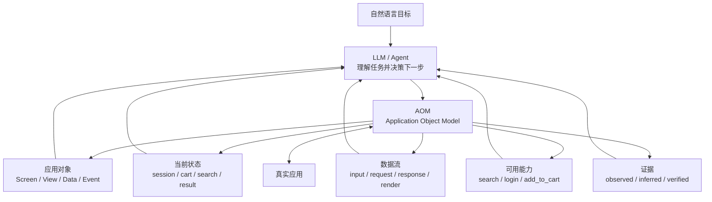
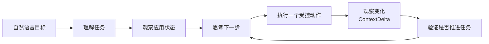
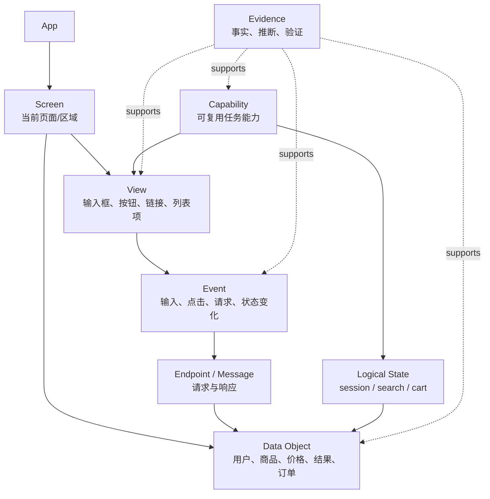
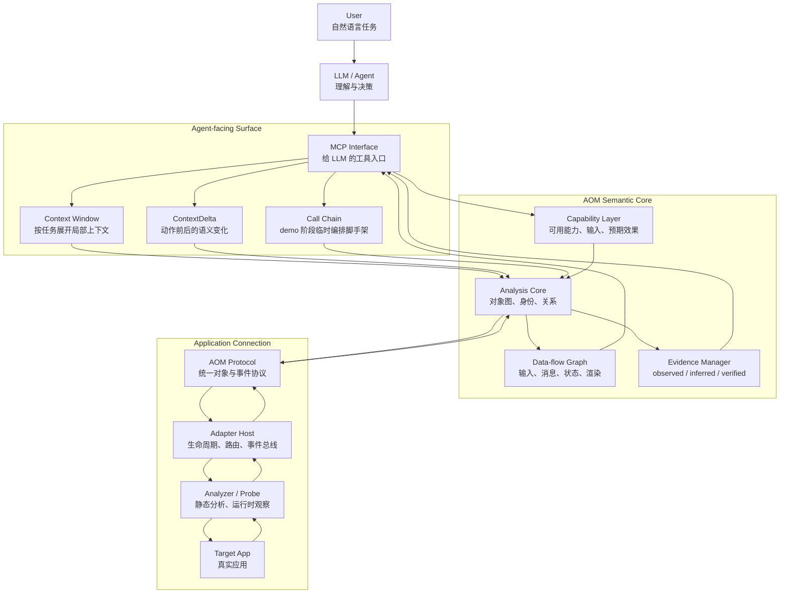
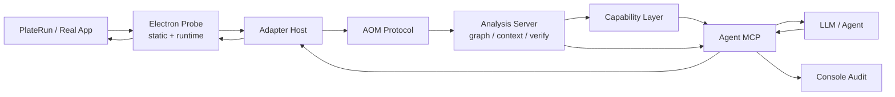

# AOM: Application Object Model

<p align="center">
  中文 | <a href="./README.en.md">English</a>
</p>


> 说明：我并不熟悉成熟的 Agent 开发体系，这个项目里的想法和设计很可能还十分粗糙，甚至有不少地方会随着实践被推翻。我也深感一个人的能力终究有限，AOM 想触碰的问题又很大，未来道阻且长。因此这份 README 更像是一份阶段性的思考记录和概念 demo 说明，而不是一个已经完成的标准答案。欢迎批评、讨论和修正。

AOM（Application Object Model）是一个概念探索项目。

它想探索的效果是：

> 用户用自然语言描述目标，LLM 能理解当前应用、理解用户任务，并在执行过程中自行思考和决策后续步骤。

也就是说，AOM 不是从“怎么自动点击一个按钮”开始的。它真正关心的是：当一个 LLM 面对一个真实应用时，它如何知道自己在哪里、看到了什么、用户想要什么、下一步应该做什么、做完之后是否真的推进了任务。

当前项目还只是一个早期 demo。它存在很多不足：真实应用覆盖有限，安全网关还不完整，数据流仍是 MVP 级，系统级 runtime/hook 能力也还在远景阶段。本项目的目标，是提出 AOM 这一想法，并实现一个简单但尽量贴近真实应用的验证原型。

## AOM 想解决的问题

自然语言对人来说很直接：

```text
帮我搜索科技资讯，打开一个相关结果。
```

但对 LLM/Agent 来说，这句话背后其实包含一连串理解和决策：

```text
这是一个什么应用？
现在处在哪个页面？
哪里可以搜索？
搜索是否已经完成？
哪些内容是结果？
哪个结果和任务相关？
打开之后任务是否结束？
如果没有变化，应该重试、换目标，还是停止？
```

如果 Agent 只能看到截图、OCR 文本、坐标、DOM selector 或一大坨无结构的工具返回，它很容易陷入两种状态：

- 看起来能操作，但不知道自己为什么这么做；
- 做了一步之后，不知道任务是否推进，于是重复搜索、重复点击、乱翻上下文。

AOM 的核心想法是：给 LLM 一个应用语义层，让它不是直接面对混乱的界面表象，而是面对一个可以推理的应用对象模型。

## 什么是 Application Object Model

AOM 可以理解为“应用给 LLM 的世界模型”。

它把真实应用中的结构、状态、事件、数据流和能力整理成一组对象和关系，让 LLM 可以围绕这些对象进行推理。



在这个模型里，LLM 不只是看到“屏幕上有一些文字和按钮”，而是看到：

```text
当前页面是什么？
页面上有哪些稳定对象？
这些对象和业务状态是什么关系？
哪些动作可能推进用户任务？
上一步动作造成了什么变化？
这个变化是否有证据支持？
```

这就是 AOM 名字里的 Object Model：它不是把界面压平成像素或文本，而是把应用重新表达为可理解、可查询、可验证的对象系统。

## AOM 的目标不是替代 LLM 思考

AOM 不应该变成一个黑箱自动执行器。

它更像是给 LLM 提供一套结构化感知和反馈机制：

```text
LLM 负责理解目标、权衡选择、决定下一步。
AOM 负责描述应用、暴露能力、执行受控动作、反馈变化证据。
```

理想情况下，LLM 和 AOM 之间形成一个循环：



这里最重要的不是“自动化执行”，而是持续理解。

如果搜索已经成功，AOM 应该告诉 LLM：结果出现了，下一步应该看结果，而不是继续搜索。

如果点击没有造成任何变化，AOM 应该告诉 LLM：这一步是 `no_change`，不要盲目重复。

如果某个结论只是推断，AOM 应该告诉 LLM：这是 `inferred`，不是 `verified`。

## AOM 眼中的应用

在 AOM 里，一个应用不是一张截图，也不是一棵单纯的 DOM 树。它是一组持续变化的对象、状态和因果关系。



这些对象不是为了好看而抽象出来的。它们服务于 LLM 的任务推理：

- `Screen` 告诉 LLM 当前处境；
- `View` 告诉 LLM 可以关注或操作什么；
- `Data Object` 告诉 LLM 应用正在表达哪些业务内容；
- `Event` 告诉 LLM 刚刚发生了什么；
- `Endpoint` / `Message` 告诉 LLM 数据是否真的流动；
- `Storage` 告诉 LLM 哪些逻辑状态可能被改变；
- `Capability` 告诉 LLM 当前有哪些高层动作可用；
- `Evidence` 告诉 LLM 哪些结论可信、哪些只是猜测。

## AOM 框架图

当前 demo 的 AOM 框架大致分成三层：连接真实应用、构建应用语义、服务 LLM 决策。



这张图里的重点是：AOM 给 LLM 的不是完整底层细节，而是经过组织的应用语义。

LLM 不需要每次吞下整个应用图。它应该拿到和当前任务有关的窗口、上一步变化、可用能力和证据，然后自己决定下一步。

## ContextDelta：让 LLM 知道“刚刚发生了什么”

LLM 做任务时最容易迷路的地方，不是第一步，而是第二步。

它执行了一个动作之后，如果只拿到一份新的巨大上下文，它可能不知道：

- 这个动作是否成功；
- 哪些内容是刚刚新增的；
- 当前是否应该继续同一能力；
- 是否已经进入下一阶段；
- 是否应该停止。

因此 AOM 引入 `ContextDelta`：

```text
上一刻应用状态
  + 刚刚执行的动作
  + 新观察到的事件和数据变化
  -> 语义变化摘要
```

它面向 LLM 说明：

```text
outcome: verified / changed / no_change / failed / ambiguous
summary: 发生了什么
recommendedTargets: 现在最相关的对象
nextStepHint: 下一步应该考虑什么
evidenceIds: 这个判断的证据
```

这使 AOM 不只是“给 LLM 看应用”，而是帮助 LLM 维持连续任务状态。

## 临时 Call Chain 与未来 Agent Loop

AOM 当前 demo 里有一个很小的动态 `Call Chain` 机制。它的存在主要是为了让早期演示效果更稳定：当外部 Agent 还不能很好地利用 AOM 的语义反馈时，AOM 临时给出一串建议工具调用，帮助 demo 避免重复搜索、重复点击或上下文爆炸。

因此，`Call Chain` 不应该被理解为 AOM 的长期核心能力。它更像是一个脚手架：

```text
当前任务 + 当前图 + 最近 ContextDelta
  -> 临时建议下一组 AOM 工具调用
  -> 帮助早期 Agent 少走明显弯路
```

长期路线应该是更深地结合 Agent 自身的 loop 和编排能力。也就是说，AOM 不需要自己变成 planner；AOM 应该提供高质量的应用语义状态、变化反馈、证据和能力边界，让 Agent 自己在内部循环中使用这些信息。

更理想的关系是：

```text
AOM 提供：
  当前应用状态
  可用对象和能力
  上一步 ContextDelta
  Evidence 和不确定性
  风险与权限边界

Agent loop 负责：
  理解用户目标
  选择下一步策略
  决定是否继续、换路或停止
  吸收自己的历史记忆和推理优化
```

换句话说，AOM 未来更像是 Agent loop 的应用语义底座，而不是 Agent loop 之外的单独编排器。

当前 `Call Chain` 保留的意义，是在 demo 阶段明确暴露一件事：当 AOM 能告诉 Agent“搜索已经 verified”“这个目标 no_change”“这里有 recommendedTargets”时，Agent 就应该把这些反馈吃进自己的下一步推理，而不是继续盲目重复上一个动作。

## Evidence-first：AOM 不把猜测伪装成理解

AOM 的一个重要原则是：能观察就观察，能验证就验证，不能验证就承认不确定。

它不会把一个启发式判断包装成绝对事实。相反，它会尽量区分：

- `observed`：直接观察到的事实；
- `inferred`：基于结构、命名、事件做出的推断；
- `verified`：通过动作后的状态、事件或数据流验证过的结论。

这对 LLM 很重要。因为 LLM 本身很擅长补全和联想，如果应用层再把不确定信息伪装成确定事实，整个系统就会快速滑向幻觉。

AOM 希望做相反的事：把不确定性显式暴露出来，让 LLM 在知道证据强弱的前提下做决策。

## 让 LLM 的操作可审计

AOM 还有一个隐藏但很重要的优势：它可以让 LLM 的应用操作变得可审计。

如果一个 LLM 直接根据截图、坐标或临时上下文操作应用，事后很难回答：

```text
它为什么点了这个对象？
它当时看到了什么？
它认为任务处在哪个阶段？
它依据什么判断动作成功？
它失败后为什么选择重试或换目标？
有没有误把猜测当成事实？
```

AOM 的对象、能力、ContextDelta、Evidence 和 audit log 可以把这条链路记录下来：

```text
自然语言目标
  -> LLM 选择的 AOM 对象或能力
  -> 动作派发
  -> 运行时事件和状态变化
  -> Evidence-linked 判断
  -> 下一步决策依据
```

这意味着 LLM 不再只是“黑箱地操作了应用”。它的每一步都可以被追问、复盘和改进。

可审计性对 AOM 很关键，因为真实应用操作天然带有风险。即便当前 demo 还没有完整 Safety Gateway，AOM 也应该尽早保留：

- Agent 调用了哪个工具；
- 目标对象是什么；
- 输入和动作摘要是什么；
- 动作后发生了什么变化；
- 哪些判断是 observed、inferred 或 verified；
- 为什么建议下一步继续、停止、换目标或重新观察。

长期来看，这种审计能力可以成为安全网关、权限确认、错误复盘和 Agent 自我改进的基础。

## AOM 和未来系统级 runtime

长期来看，AOM 想要的效果接近一种应用语义运行时。

理想状态下，操作系统或应用运行时可以天然暴露：

```text
应用对象
任务状态
事件
数据流
可用能力
权限与审计
```

当前 demo 还远远没有到这个阶段。现在主要通过外部 Adapter、Analyzer、Probe 去采集事实，再由 Analysis Core 组织成对象模型。

未来可能有多层路线：

```text
公开系统接口
  -> Accessibility / window tree / system events

用户授权的运行时介入
  -> CDP / debug launch / handoff

应用协作层
  -> SDK / plugin / semantic adapter

系统原生 AOM Runtime
  -> OS/runtime 直接暴露应用对象和任务语义
```

无论底层方式如何变化，AOM 的核心目标不变：让 LLM 理解应用和任务，而不是只处理低层界面信号。

## 当前 demo 做到了什么

当前 `0.1.0-dev.1` 基线已经具备一个最小闭环：

- 从真实应用采集静态和运行时事实；
- 生成 AOM 对象图；
- 生成 Evidence-linked MVP data-flow graph；
- 挖掘简单 capability；
- 通过 MCP 给 LLM 暴露上下文窗口；
- 在动作后返回 ContextDelta；
- 用临时 Call Chain 验证“语义反馈可以指导下一步”的 demo 效果；
- 用 audit 记录工具调用、动作结果、语义变化和决策依据。

它还没有完成：

- 完整安全网关；
- 通用 OS-level runtime/hook；
- 任意应用的完整数据血缘；
- 大规模真实应用覆盖；
- 成熟产品级发布。

## 当前额外难题

除了功能还不完整，AOM 还面临一些更深层的技术难题。这些难题来自当前 demo 和真实 Agent 回归里的失败复盘，不是简单靠“多写几个工具”就能解决。它们分别卡在不同层级。

### 1. 应用分析层未必能拿到足够原始数据

AOM 的理解质量首先受限于底层能观察到什么。

真实应用可能不会暴露调试端口，Accessibility 信息可能不完整，网络 payload 可能被脱敏或加密，状态可能藏在本地 store、IPC、preload bridge、native module 或缓存里。

这意味着 AOM 不能假设自己总能拿到完整事实。它必须接受部分可见、部分缺失、部分不可验证的状态，并把这种不确定性明确表达给 LLM。

### 2. 归一分析层很难把内容组织好

即使采到了很多原始数据，把它们组织成 LLM 真正能理解的对象模型也很难。

一个真实应用里会有重复列表、虚拟滚动、动态 class、语言变化、模态框、历史页面残留、相似按钮、异步数据更新。AOM 需要判断哪些对象是同一个，哪些关系是可信的，哪些只是暂时相邻，哪些内容应该被折叠，哪些必须保留。

如果组织得太粗，LLM 看不到关键线索；如果组织得太细，LLM 又会被上下文淹没。

### 3. 交互层还不能稳定优化上下文利用率

LLM 的上下文是有限的，而真实应用的对象图可能很大。

AOM 需要决定什么时候给完整上下文，什么时候只给窗口，什么时候只给 delta，什么时候保留 data-flow，什么时候隐藏历史对象。这不是简单压缩 JSON，而是要把“对当前任务有用的信息”稳定筛出来。

当前的 `context_window`、`context_delta` 和 compact response 只是早期尝试。长期还需要更深地结合 Agent 自身的上下文管理和记忆机制。

真实回归里已经出现过这样的失败：AOM 其实观察到了搜索成功，但默认返回仍然太大，Agent 没有真正消化成功证据，后续又开始翻窗口、重复搜索或低层点击。这说明问题不只是“有没有上下文”，而是“上下文是否以任务阶段可用的形式进入了 Agent loop”。

### 4. Agent-facing 语义还不够任务化

很多时候 AOM 能给出结构事实，却还不能稳定给出任务状态。

Agent 最需要的不是一堆 view、edge 和 endpoint，而是类似这样的信号：

```text
当前任务阶段是什么？
上一动作是否完成？
下一步应该看哪些候选对象？
哪些动作不要再重复？
```

如果 AOM 只告诉 Agent“这里有搜索框、这里有结果链接、这里有请求”，Agent 仍然可能不知道“搜索阶段已经完成”。更理想的表达应该是 `SearchSubmitted`、`ResultsAvailable`、`OpenResultCandidate` 这类任务阶段和候选对象，而不只是零散结构事实。

### 5. Capability 还没有形成完整 workflow

当前 capability 仍然偏 MVP recipe。它可以表示“搜索”“加入购物车”这类能力，但很多能力还没有完整封装成任务闭环。

例如一个真正可用的搜索能力不应该只做输入或提交，它还应该包含：

```text
输入 query
触发提交
等待相关 endpoint 或状态变化
识别结果列表
暴露可打开的结果候选
降低重复搜索优先级
```

否则 Agent 会一直看到 `search_content` 仍然可用，于是误以为下一步还是搜索，而不是打开结果。

### 6. 还不能稳定让 Agent 规划工具调用

AOM 可以暴露对象、能力、变化和证据，但真正的下一步规划应该由 Agent 自己完成。

当前 demo 里的 `Call Chain` 只是临时脚手架，用来验证语义反馈是否能减少重复搜索、重复点击和无效重试。长期需要让 Agent 把 AOM 输出吃进自己的 agent loop，在自身编排能力、历史记忆和任务推理中决定下一步，而不是依赖 AOM 在外部硬塞一条固定调用链。

这里还有一个现实问题：工具描述只能“劝”Agent，不是强约束。即使工具 schema 写得很清楚，只要可选路径太多，Agent 仍可能绕回 `context_pack`、低层 `invoke_view` 或重复 capability。因此长期更应该让 AOM 输出稳定的任务状态和效果反馈，而不是只靠提示词式工具描述维持正确调用顺序。

### 7. 工具和对象身份可能失效

真实应用状态变化后，某些 capability 或 view target 可能变成 stale。

如果 capability ID 绑定了某个具体 view，而页面轻微变化导致 view ID 改变，Agent 可能拿着旧 ID 继续调用，出现 `unknown_capability`、目标不存在或动作无效。

AOM 需要更稳定地区分：

```text
能力名称
当前可用实例
底层 view target
一次性 raw reference
```

否则 LLM 会把“刚刚可用的能力”误当成“现在仍然可用的能力”。

### 8. 执行层本身仍然不稳定

即使理解和规划都正确，真正执行动作仍然可能失败。

目标应用可能焦点丢失、窗口被遮挡、元素被虚拟列表回收、点击被动画拦截、输入框状态变化、运行时连接断开，或者系统权限阻止观察和操作。

所以 AOM 不能把“发出了动作”当成“完成了任务”。它必须持续观察执行结果，并把 `verified`、`no_change`、`failed`、`ambiguous` 这类状态反馈给 LLM。

更细一点说，`actionResult.ok` 只能表示动作成功派发，不代表用户目标成功。AOM 必须继续检查事件、状态变化、endpoint、data-flow 或 UI diff，才能判断这一步是否真的推进了任务。

### 9. 系统边界容易膨胀

AOM 很容易被诱惑着继续往外扩：做 RAG、做长期记忆、做完整 planner、做调试入口、做脚本系统、做 Agent 框架。

但这些不应该是 AOM 的核心职责。

更清晰的边界应该是：

```text
AOM 提供当前应用的结构化事实、语义状态、能力、变化和证据。
Agent 负责长期记忆、任务规划、经验复用和多轮策略。
```

也就是说，AOM 可以提供 retrieval-friendly 的结构化视图，但不应该拥有自己的 RAG memory layer；AOM 可以提供临时调用链验证 demo 效果，但不应该把自己变成 Agent planner。

这些难题也是 AOM 这个概念真正有价值的地方：它不是假设应用是完全可控的，而是试图在真实应用的不完整、不稳定和不确定中，为 LLM 提供一个可以持续推理的语义层。

所以这个项目目前更像是一颗种子：它展示了一种可能的应用交互范式，而不是宣称已经解决所有应用自动使用问题。

## 当前 demo 项目实现细节

这一部分介绍当前仓库里的 demo 是怎么落地的。

### 仓库结构

```text
.
├── AOM/          AOM 本体：协议、采集、分析、能力、MCP、Console、文档
├── targetAPP/    外部目标应用 demo：PlateRun，一个普通 Electron 食品配送应用
└── harderTestApp/真实应用压力样本，用于验证静态分析边界（可以自选Electron框架应用，仓库未提供）
```

`targetAPP/` 必须保持普通应用身份。它不是 AOM SDK 示例，也不应该塞入 AOM 专用 selector、隐藏按钮或测试后门。这个约束很重要：demo 的意义在于尽量证明 AOM 面对的是一个真实外部应用，而不是为 AOM 特制的玩具页面。

### 快速验证

当前项目分成 Rust workspace 和 TypeScript workspace。最基础的验证命令是：

```bash
cd AOM
cargo test
pnpm test
pnpm build

cd ../targetAPP
pnpm test
pnpm build
```

如果需要生成第一个本地 dev build：

```bash
cd AOM
pnpm release:dev 0.1.0-dev.1
```

生成物会写入：

```text
AOM/releases/0.1.0-dev.1/
```

其中包含 workspace archive、几个 TypeScript package tarball、`manifest.json` 和 `SHA256SUMS`。

> 需要注意的是项目全程在 macOS 环境下开发，因此也建议您使用 macOS 来进行复现。

### Demo 目标应用：PlateRun

`targetAPP/` 是当前主要演示目标。它是一个 Electron food delivery demo，包含：

- renderer UI；
- mock backend；
- 登录、浏览餐厅、搜索、加入购物车等常见交互；
- 可打包为 macOS Electron app；
- 不包含 AOM 专用后门。

常用命令：

```bash
cd targetAPP
pnpm dev        # 开发模式
pnpm build      # 构建 renderer/main/server
pnpm dist:mac   # 生成 macOS app 目录
```

打包后的 PlateRun 可用于静态 artifact 分析和动态 runtime probe。

### 当前实现链路

当前 demo 的主链路可以理解为：



换成文字，就是：

```text
真实应用
  -> Analyzer/Probe 采集静态和运行时事实
  -> Adapter Host 统一管理 target、事件、动作和 adapter
  -> AOM Protocol 传递 raw snapshot/event/action
  -> Analysis Core 生成 AOM graph、data-flow、Evidence、context
  -> Capability Layer 生成可用能力
  -> Agent MCP 把语义窗口、delta、能力和动作接口暴露给 LLM
  -> Console/Audit 记录整个过程
```

### Rust 模块

`AOM/crates/` 目前包含：

| Crate | 作用 |
| --- | --- |
| `aom-protocol-rs` | Rust 侧协议类型，覆盖 raw snapshot/event/action、AOM node/edge、capability、target lifecycle 等 |
| `aom-adapter-host` | Adapter Host，负责 artifact parser、adapter registry、runtime probe、event bus、target lifecycle、action routing |
| `aom-analysis-core` | Analysis Core，负责归一化、稳定 ID、对象图、Evidence、data-flow、context pack、diff/verification |
| `aom-analysis-server` | AnalysisService 和 CLI bridge，把 raw bundle 转成 graph/context/capabilities/verification |
| `aom-capability` | Capability MVP，从 AOM graph 挖掘可执行能力、slot、action plan、expected effects、risk |

其中 `aom-analysis-server` 有两个重要命令入口：

```bash
cargo run -p aom-analysis-server --bin aom-analyze-bundle -- <input.json> <output-dir>
```

它会输出：

```text
graph.json
context-pack.json
capabilities.json
```

另一个 `aom-analysis-bridge` 从 stdin 读取 AnalysisInput，输出单个 JSON，主要供 TypeScript/MCP 侧桥接使用。

### TypeScript 模块

`AOM/packages/` 目前包含：

| Package | 作用 |
| --- | --- |
| `@aom/protocol` | TypeScript 侧协议类型和 fixture 验证 |
| `@aom/electron-probe` | Electron 静态分析、ASAR/HTML/JS 提取、CDP/Playwright runtime probe、stdio analyzer session |
| `@aom/agent-mcp` | Agent-facing MCP server，提供 context、capability、invoke、delta、audit、CLI config control |
| `@aom/console` | Console audit baseline，用于查看 MCP 调用日志和结果摘要 |

当前 MCP server 入口：

```bash
cd AOM
pnpm build
node packages/aom-agent-mcp/dist/bin/aom-mcp-server.js
```

这个 server 是 stdio MCP server，面向 Claude Code 或其他 MCP host。修改 MCP 工具描述或 schema 后，需要重启 MCP server，外部 Agent 才能吃到新工具定义。

### Agent-facing MCP 工具面

当前 demo 的 MCP 工具面大致分为几类。

连接和生命周期：

```text
aom.launch_for_handoff
aom.attach_existing
aom.detach
aom.session_status
```

上下文和分析：

```text
aom.route_context
aom.context_window
aom.context_delta
aom.context_pack
aom.analysis_graph
aom.capabilities
```

执行和反馈：

```text
aom.invoke_capability
aom.invoke_view
aom.call_chain
```

这里有几个使用原则：

- 首选 `route_context` 和 `context_window`，不要一上来吞完整 `context_pack`。
- 动作后优先看 `context_delta`，而不是重新理解整个页面。
- `invoke_capability` 比低层 `invoke_view` 更接近 AOM 的目标；`invoke_view` 是 fallback。
- `actionResult.ok` 只表示动作派发成功，不代表任务成功。
- `aom.call_chain` 是 demo 阶段的临时建议链，不是长期 planner。

### AOM CLI

当前仓库还提供一个很窄的 `AOM-cli` 配置控制面。它不负责启动 target、不管理 session、不执行分析、不替代 MCP。

它只负责：

```text
feature flags
feature 参数
日志等级
audit verbosity
配置查看/校验/init guide
```

入口：

```bash
cd AOM
./AOM-cli -help
./AOM-cli -feature -help
./AOM-cli -log -help
./AOM-cli -config -help
```

这条边界是刻意收窄的：AOM CLI 是本体配置面，不是另一个 Agent 框架，也不是调试脚本系统。

### 当前 demo 已验证的能力

当前 baseline 已经验证了几条关键链路：

- packaged Electron app 的静态 artifact 分析；
- Electron ASAR 中的 HTML/JS/API endpoint 提取；
- CDP/Playwright runtime snapshot 和事件采集；
- object-addressed action；
- 登录前后 runtime node 增长和 network/state event 采集；
- Analysis graph、Evidence、context pack、data-flow graph；
- `login`、`search_product`、`view_product_detail`、`add_to_cart` 等 MVP capability；
- `ContextDelta` 对动作前后变化的摘要；
- compact MCP response，避免默认工具结果撑爆上下文；
- Console audit 记录工具调用、动作结果和 delta 摘要；
- dev release `0.1.0-dev.1`；
- 通过自然语言完成targetApp的任务。

### 关键产物

真实或半真实分析链路通常会产生这些文件：

```text
raw-bundle.json       原始静态/动态采集输入
graph.json            AOM 对象图
context-pack.json     面向 LLM 的语义上下文包
capabilities.json     可执行能力列表
audit jsonl           MCP 工具调用审计记录
manifest.json         dev release 元数据
SHA256SUMS            dev release 校验
```

当前仓库中一些历史 trace 位于：

```text
AOM/docs/traces/
```

这些 trace 的价值不只是“证明跑过”，更重要的是记录设计被真实失败推动的过程：上下文爆炸、搜索成功但 Agent 重复搜索、attach-existing 无 CDP 时正确拒绝、handoff 生命周期等。

### 运行时生命周期边界

AOM 当前区分几种 target 生命周期：

```text
attach_existing          介入用户已运行的应用，不静默关闭/重启
launch_owned             AOM 自己启动，session 结束后可由 AOM 清理
launch_for_handoff       AOM 启动可调试应用，再交还给用户继续操作
copy_for_static_analysis 对 artifact 副本做静态分析，避免影响运行中应用
```

这条边界非常重要。AOM 的目标不是偷偷接管用户应用，而是在明确生命周期和权限语义下，为 LLM 提供应用状态和可控动作。

### 开发注意事项

继续开发时，最好守住几条原则：

- `targetAPP/` 不加 AOM 专用后门。
- Adapter/Probe 只采事实，不做应用语义判断。
- Analysis 层负责归一、关系、Evidence、data-flow。
- Capability 可以有 MVP recipe，但必须承认它不是通用应用理解。
- 新功能要同时更新 `AOM/docs/`，否则后续 Agent 和我都很难理解设计意图。

## 有什么用？

AOM 是给 LLM 的应用语义层，也是让 LLM 应用操作可追踪、可解释、可审计的一种尝试。

它希望让 LLM 能通过自然语言理解用户任务，通过应用对象模型理解当前应用，并基于证据持续思考、决策和推进后续步骤。至于怎么具体落地应用就要靠大家的想象力创造力了。
